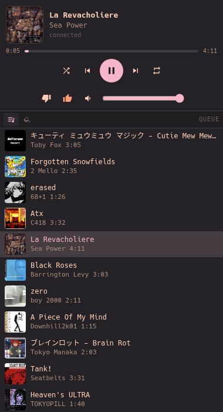
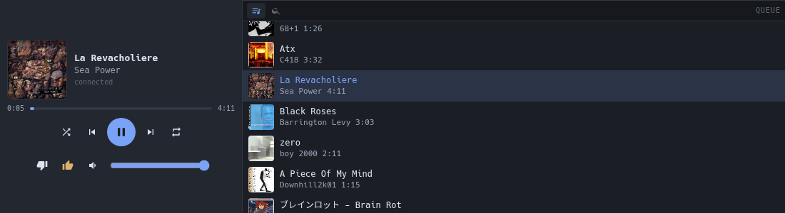
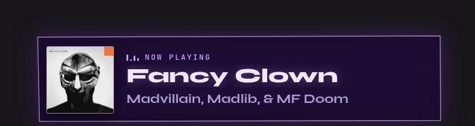

<div align="center">

# obs-pear-remote

**Control Pear Desktop from an OBS dock, and put what's playing on stream.**<br>
Two HTML files. No build, no plugin, nothing to install but Python.

[](#quick-start)
[](https://github.com/pear-devs/pear-desktop)
[](#quick-start)
[](LICENSE)




</div>

> Unofficial, vibecoded, and not affiliated with Pear Desktop, YouTube or Google.
> [The fine print.](#the-fine-print)

## What you get

**Pear Remote** (`pear-remote.html`, a custom browser dock): play/pause, previous/next, seek,
volume and mute, like/dislike, shuffle and repeat. It shows the live queue (click a song to jump to
it, ✕ to remove it) and has a search box whose results you can play now, play next or add to the
end. When the dock is wider than it is tall, it switches to a side-by-side layout.

**Now Playing** (`now-playing.html`, a browser source): cover, title and artist. Long titles
scroll, the card dims while paused and hides itself when nothing is playing. On Linux it can also
show the YouTube video playing in your browser ("Now watching") while Pear is idle or paused.

<div align="center">

</div>

## Quick start

**1. In Pear**, open **Plugins** and enable **API Server** (keep port `26538` and *Authorize at
first request*) and **Amuse**.

**2. Serve the files** on loopback, and leave the server running while you stream:

```sh
git clone https://github.com/cybWasHere/obs-pear-remote
python3 obs-pear-remote/extras/serve.py 9870 --bind 127.0.0.1 --directory obs-pear-remote
```

On Windows, double-click `extras\start-server.cmd` instead; closing its window stops the server.

**3. In OBS**, add them:

| | where | URL |
|---|---|---|
| Remote | *Docks › Custom Browser Docks…* | `http://127.0.0.1:9870/pear-remote.html` |
| Card | *Browser* source, 800 × 300 | `http://127.0.0.1:9870/now-playing.html` |

The first time the dock connects, Pear asks whether to allow `obs-pear-remote`. Click **Allow**;
Pear remembers it. The card's background is already transparent.

<details>
<summary><b>Requirements</b></summary>
<br>

- **Pear Desktop**, tested with 3.12.0.
- **OBS Studio 30 or newer**, tested with 32.2.2 on Linux and 32.2.1 on Windows 11. Custom browser
  docks need the browser plugin, which the official builds include.
- **Python 3**, only to serve the files. On Windows, install it from python.org (that adds the `py`
  launcher).

No git? *Code › Download ZIP* on GitHub works just as well.

</details>

<details>
<summary><b>Other ways to serve, and starting at login</b></summary>
<br>

`extras/serve.py` is Python's `http.server` plus one endpoint, `/mpris.json`, which the card uses for
the browser-video fallback. That fallback is Linux only; without it, the stock server does the rest:

```sh
python3 -m http.server 9870 --bind 127.0.0.1 --directory obs-pear-remote          # Linux / macOS
py -m http.server 9870 --bind 127.0.0.1 --directory C:\path\to\obs-pear-remote    # Windows
```

**At login:**

- **Linux**: `extras/obs-pear-remote.service` is a systemd user unit that runs `serve.py`. Copy it
  to `~/.config/systemd/user/` (if you cloned somewhere other than `~/obs-pear-remote`, fix both
  paths on its `ExecStart` line), then
  `systemctl --user enable --now obs-pear-remote`.
- **Windows**: put a shortcut to `extras\start-server.cmd` in the Startup folder (Win+R,
  `shell:startup`) and set the shortcut to *Run: Minimized*.

</details>

## Good to know

- **Keep `--bind 127.0.0.1`.** The API server controls your playback, so the page holding its token
  should only be reachable from your own machine. Serving over `http://` rather than opening the
  files as `file://` also avoids the cross-origin and local-network restrictions of OBS's browser.
- **Amuse does double duty.** The card reads everything from it; the remote uses it only as a
  fallback for the current song until Pear sends its first player event.
- **The dock reloads itself** whenever `pear-remote.html` changes on disk, since docks have no
  reload button. `?reload=0` turns that off.
- **Search needs YouTube Music in English.** Results are filtered on its "Song" / "Video" labels.
- **Pear 3.12.0 has two gaps.** It doesn't report repeat, mute or volume changes over its
  websocket, so those buttons work but never light up. And on an endless radio/autoplay queue it
  accepts "add to the end" but the song never appears (calling Pear's API directly does the same);
  use **▶ next** there.

## Options

Append them to the URL, e.g. `pear-remote.html?theme=midnight&amuse=0`.

**pear-remote.html**

| option | default | what it does |
|---|---|---|
| `api` | `http://127.0.0.1:26538` | Pear API Server address |
| `client` | `obs-pear-remote` | client name shown in Pear's authorize prompt |
| `amuse` | `http://127.0.0.1:9863/query` | Amuse fallback; `0` turns it off |
| `theme` | `ferra` | `ferra` or `midnight` |
| `reload` | `1` | `0` stops the reload-on-change check |

**now-playing.html**

| option | default | what it does |
|---|---|---|
| `amuse` | `127.0.0.1:9863`, then `localhost:9863` | Amuse endpoint to poll |
| `video` | `/mpris.json` | browser YouTube fallback from `serve.py`; `0` turns it off |
| `theme` | `purple` | `purple` or `mono` |

<details>
<summary><b>Making your own theme</b></summary>
<br>

All colours are CSS variables in `:root[data-theme="…"]` blocks at the top of each file. Copy a
block, give it a new name, change the colours and select it with `?theme=`.

For the card you can leave the file alone and override the variables in the browser source's
**Custom CSS** field instead, e.g. `:root { --accent: #7fdbca; --panel: rgba(0,0,0,.6); }`. Docks
have no such field, so the remote needs a theme block.

</details>

## Troubleshooting

| you see | why, and what to do |
|---|---|
| **"Pear API server not reachable"** | Pear isn't running, *Plugins › API Server* is off, or it listens on another port (set `?api=`). |
| **"Pear denied obs-pear-remote"** | Someone clicked Deny. Pear doesn't remember a denial, so reload the dock to be asked again: save `pear-remote.html` in any editor (the reload-on-change check picks it up) or restart OBS. |
| **Nothing loads** | Is the server running? `http://127.0.0.1:9870/pear-remote.html` should open in a normal browser too. The URL must start with `http://`, not `file://`. |
| **The card never appears** | *Plugins › Amuse* is off, or nothing is playing. `http://127.0.0.1:9863/query` should return JSON. |
| **Queue empty or song missing right after Pear starts** | Pear reports the player state only after its first player event. Press play/pause once. |
| **The card ignores your edits** | OBS caches the page (Python's server sends no cache headers). In the source's properties, click *Refresh cache of current page*. |
| **Windows: "Python 3 was not found, or it does not start"** | `py` or `python` points at a Python that was uninstalled. Reinstall it from python.org. |
| **Windows firewall prompt for YouTube Music** | That's Pear: its Amuse plugin listens on every interface. *Cancel* is fine, the widgets only talk to `127.0.0.1`. |

## The fine print

**Unofficial and vibecoded.** This project is not affiliated with, endorsed or published by the
Pear Desktop project, YouTube or Google. The code and these docs were written by Claude, an AI
coding agent, directed by the repo owner, who tested them in OBS on Linux and Windows 11. No human
has reviewed the code line by line. Read it before you trust it.

**Thank you, [pear-devs](https://github.com/pear-devs/pear-desktop).** Their API Server and Amuse
plugins do the real work; this repo is two pages that talk to them.

**License.** MIT, see [LICENSE](LICENSE).
